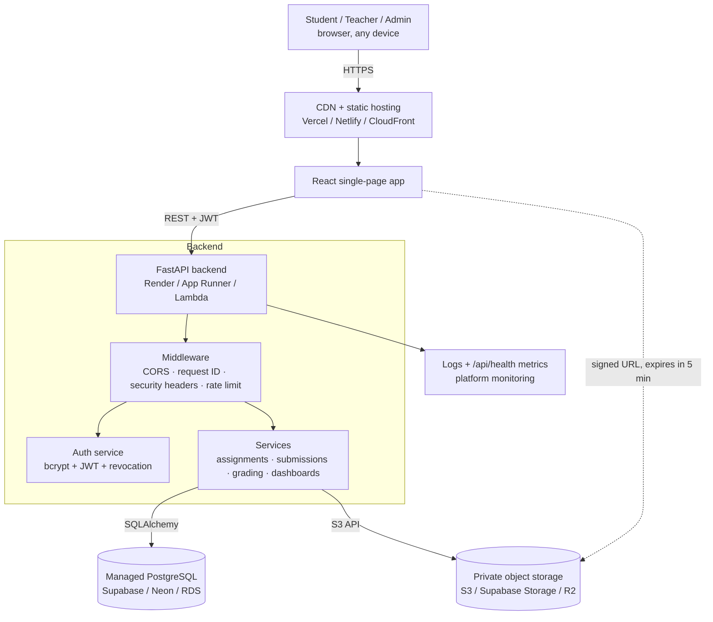
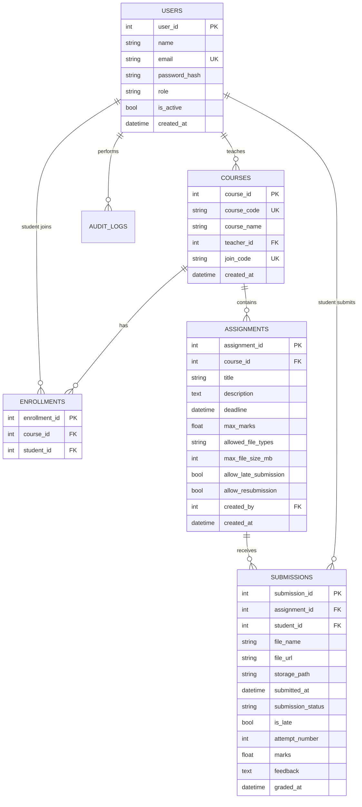
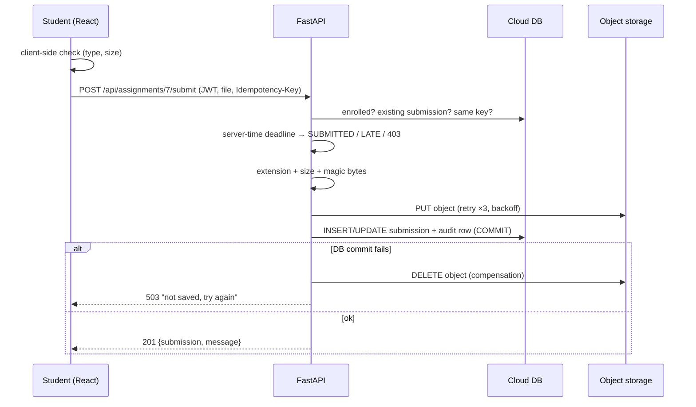

# Cloud-Based Student Assignment Submission & Feedback Portal

> A cloud-native portal where teachers publish assignments, students upload their work to **private object storage**, and teachers return **marks and written feedback**. It uses JWT authentication, role-based access control, a **managed-database-ready** data layer, signed download URLs and automated tests, and it deploys on free-tier cloud services.


All people, courses and assignments in this project are **fictional demo data**.

---

## Table of contents
[Overview](#overview) · [Problem statement](#problem-statement) · [Objectives](#objectives) · [Features](#features) · [User roles](#user-roles) · [Cloud computing concepts](#cloud-computing-concepts) · [Architecture](#architecture) · [Technology stack](#technology-stack) · [Database design](#database-design) · [Cloud storage](#cloud-storage) · [Authentication & authorization](#authentication--authorization) · [Assignment workflow](#assignment-workflow) · [Submission workflow](#submission-workflow) · [Feedback & grading](#feedback--grading) · [REST APIs](#rest-apis) · [Folder structure](#folder-structure) · [Installation](#installation) · [Environment variables](#environment-variables) · [Local setup](#local-setup) · [Running the application](#running-the-application) · [Testing](#testing) · [Cloud deployment](#cloud-deployment) · [Security](#security) · [Scalability](#scalability) · [Failure handling](#failure-handling) · [Screenshots](#screenshots) · [Results](#results) · [Limitations](#limitations) · [Future improvements](#future-improvements) · [Learning outcomes](#learning-outcomes) · [Author](#author)

Detailed documents live in [`docs/`](docs) and the full academic report is in [`reports/project-report.md`](reports/project-report.md).

---

## Overview

The portal replaces emailed attachments and paper hand-ins with one cloud service:

```
Teacher ─► creates assignment ─► Cloud DB ─► Student dashboard
Student ─► uploads file ─► Object storage (private)  +  metadata ─► Cloud DB
Teacher ─► reviews via signed URL ─► marks + feedback ─► Cloud DB ─► Student sees feedback
```

The main goal is to show cloud-computing ideas in working code, not only a file-upload website. The project shows:

* **Separation of data**: *metadata* goes in a relational database and *files* go in object storage.
* **Provider-agnostic cloud layer** (`cloud/`): SQLite → PostgreSQL and a local folder → S3/Supabase/R2/MinIO, switched with **environment variables only**.
* **Stateless API**: JWT auth, so any number of identical API instances can run behind a load balancer.
* **Security**: RBAC, ownership checks, private bucket and short-lived signed URLs, magic-byte file validation, rate limiting and audit logs.
* **Operations**: health checks, request IDs, structured logs, CI, Docker, a Render blueprint and a serverless (Lambda) entry point.

## Problem statement

Schools and colleges often collect assignments by email, messaging apps, pen drives or paper. Files get lost, deadlines are argued about because nobody trusts the timestamp, teachers keep marks in private spreadsheets, and students cannot easily see feedback. Nothing is backed up centrally, and nothing controls who can open whose work.

## Objectives

1. Let teachers create, update and delete assignments with deadlines, marks and file rules.
2. Let students upload, resubmit and download their own work from anywhere.
3. Store files in **cloud object storage** and metadata in a **cloud database**.
4. Enforce **authentication** and **role-based authorization** on every request.
5. Decide on-time or late using **server time**, with a configurable late policy.
6. Let teachers grade with validated marks and written feedback that students can read.
7. Deploy on **free-tier cloud services** and document how the design scales.
8. Prove correctness with **automated tests**.

## Features

| Area | Features |
|---|---|
| Accounts | Student self-registration, login/logout (token revocation), admin-created teacher accounts, disable/re-enable users |
| Courses | Teacher-owned courses, 6-character **join codes**, roster, enroll by email |
| Assignments | Create / update / delete, deadline, max marks, allowed file types, max file size, late policy, resubmission policy |
| Submissions | Drag-and-drop upload with progress, extension + size + **content (magic-byte)** checks, resubmission (old object removed), idempotent retries |
| Deadlines | Server-side UTC timestamps, SUBMITTED / LATE / blocked, the `is_late` flag is kept after grading |
| Grading | Marks validated against `max_marks`, feedback, regrading, graded work locked from replacement |
| Files | Private storage and short-lived **signed URLs** (view inline or download) |
| Dashboards | Student: pending/submitted/late/graded, upcoming deadlines, recent feedback, average. Teacher: students, submissions, pending reviews, late, recent uploads, deadline progress |
| Admin | User management, role changes, **audit log** viewer |
| Ops | `/api/health` (DB + storage checks + metrics), request IDs, structured logs, CI, Docker, Render blueprint, Lambda handler |

## User roles

| Permission | Student | Teacher | Admin |
|---|:--:|:--:|:--:|
| Register / log in / log out | ✅ (self-register) | ✅ (account from admin) | ✅ |
| Join a course with a join code | ✅ | — | — |
| View assignments | own courses | own courses | all |
| Create / update / delete assignment | ❌ | own courses | all |
| Upload / resubmit | own work | ❌ | ❌ |
| View / download a submission | **own only** | own courses | all |
| Enter marks & feedback | ❌ | own courses | all |
| View marks & feedback | own only | own courses | all |
| Dashboard | student | teacher | portal-wide |
| Manage users, roles, audit log | ❌ | ❌ | ✅ |

Full matrix: [docs/03-roles-and-permissions.md](docs/03-roles-and-permissions.md).

## Cloud computing concepts

| Concept | Where it appears in this project |
|---|---|
| **SaaS** | The finished portal: users only need a browser |
| **PaaS** | Backend on Render / App Runner / Cloud Run; frontend on Vercel/Netlify, so we deploy code, not servers |
| **IaaS** (optional) | Same Docker image can run on an EC2 / Azure VM / GCE instance |
| **DBaaS / cloud database** | `DATABASE_URL` → Supabase / Neon / RDS PostgreSQL ([cloud/database_service.py](cloud/database_service.py)) |
| **Object storage** | Private bucket for files ([cloud/storage_service.py](cloud/storage_service.py)) |
| **Authentication** | bcrypt + JWT ([cloud/auth_service.py](cloud/auth_service.py)) |
| **Authorization / RBAC** | `require_roles(...)` + ownership checks ([backend/middleware/auth.py](backend/middleware/auth.py), services) |
| **REST API / client-server** | React client ↔ FastAPI JSON API (`/docs`) |
| **Serverless** | [backend/lambda_handler.py](backend/lambda_handler.py) runs the same app on AWS Lambda behind API Gateway |
| **Scalability / elasticity** | Stateless API (JWT), connection pooling, horizontal scaling on the PaaS |
| **Availability** | Health check endpoint used by the platform to restart/route |
| **Load balancing** | Built into Render / App Runner / ALB; `X-Forwarded-For` and `--proxy-headers` handled |
| **CDN** | Static frontend served from Vercel/Netlify/CloudFront edge |
| **API Gateway** | AWS mapping in [docs/09-cloud-deployment.md](docs/09-cloud-deployment.md); rate limiting at the edge |
| **Env vars & secrets** | [backend/config.py](backend/config.py); nothing secret is committed |
| **Logging & monitoring** | Structured stdout logs, request IDs, `/api/health` metrics, audit log table |
| **Backup** | Managed DB point-in-time recovery, bucket versioning ([docs/11-security.md](docs/11-security.md)) |
| **CI/CD** | [.github/workflows/ci.yml](.github/workflows/ci.yml) + auto-deploy on push |

Full explanation: [docs/01-project-overview.md](docs/01-project-overview.md).

## Architecture



**Request flow for an upload:** browser → `POST /api/assignments/{id}/submit` (JWT) → role check (student) → enrollment check → server-time deadline check → resubmission/idempotency policy → file validation → **upload to object storage (3 retries)** → **metadata row in DB** (if this fails, the uploaded object is deleted) → audit log → JSON response → the UI shows a "Submitted" stamp.

Detailed diagrams (layers, sequence diagrams, advanced AWS layout): [docs/07-architecture.md](docs/07-architecture.md).

## Technology stack

| Layer | Local (free, offline) | Cloud (free tier) | Enterprise option |
|---|---|---|---|
| Frontend | React 18 + Vite | Vercel / Netlify (CDN) | S3 + CloudFront |
| Backend | FastAPI + Uvicorn | Render web service (Docker or Python) | App Runner / ECS / Lambda + API Gateway |
| Database | SQLite | Supabase or Neon PostgreSQL | Amazon RDS / Aurora |
| Object storage | Local folder + HMAC-signed URLs | Supabase Storage (S3 API) / Cloudflare R2 | Amazon S3 (SSE, versioning) |
| Auth | bcrypt + JWT (built-in) | same | Cognito / Entra ID / Firebase Auth |
| Tests / CI | pytest, moto | GitHub Actions | same |

Why these choices, and the beginner and advanced options: [docs/02-technology-options.md](docs/02-technology-options.md).

## Database design



Key constraints: `UNIQUE(assignment_id, student_id)` on submissions (one active submission per student per assignment), `UNIQUE(course_id, student_id)` on enrollments, and indexes on `users.email`, `submissions.student_id`, `submissions(assignment_id, submission_status)` and `assignments(course_id, deadline)`. **Files are never stored as BLOBs**; see [docs/04-database-design.md](docs/04-database-design.md).

## Cloud storage

| Stored in the **database** | Stored in **object storage** |
|---|---|
| users, courses, enrollments, assignments, deadlines, submission metadata (name, size, checksum, key, status), marks, feedback, audit logs | the uploaded PDF / DOCX / ZIP / image / code files |

Object key layout (generated by the server and never taken from user input):

```
assignments/
  assignment_001/
    student_003/
      20260925T101500Z_3f9a1c2e.pdf     ← timestamp + random id + validated extension
    student_004/
      20260925T113012Z_9b7d0e41.pdf
```

The bucket is **private**. Students and teachers get a **pre-signed URL that expires after 300 s**, and the API only issues it after checking that the user may see that submission. Details: [docs/05-cloud-storage-design.md](docs/05-cloud-storage-design.md).

## Authentication & authorization

* **Authentication ("Who are you?")**: `POST /api/login` checks the bcrypt hash and returns a signed JWT (`sub`, `role`, `jti`, `exp`). Every request sends `Authorization: Bearer <token>`. Logout stores the token's `jti` in `revoked_tokens`, so the token is dead immediately.
* **Authorization ("What are you allowed to do?")**: route-level `require_roles("teacher", "admin")`, then resource-level checks in services: *is this YOUR submission?*, *is this YOUR course?*. The role is read from the database on every request, so demotion or deactivation takes effect instantly.

Protections verified by tests: a student cannot open teacher endpoints (403), grade (403), or read or download another student's submission (403). A teacher cannot touch another teacher's course (403). Unauthenticated file access fails (401), and tampered or expired signed links fail (403).

## Assignment workflow

`createAssignment()` → validates course ownership, future deadline, `0 < max_marks ≤ 1000`, allowed types ⊆ portal whitelist, and size ≤ portal limit.
`updateAssignment()` → same rules, and refuses to lower `max_marks` below a mark already awarded.
`deleteAssignment()` → refuses if submissions exist unless `force=true`, which also deletes their objects.
`getAssignments()` / `getAssignmentById()` → role-aware (students see their status, teachers see submission counts).

## Submission workflow



Statuses: `NOT_SUBMITTED` (computed, no row) → `SUBMITTED` or `LATE` → `GRADED`.
Late policy: per-assignment `allow_late_submission` (default from `ALLOW_LATE_SUBMISSIONS`). If it is false, a late upload gets **403 DEADLINE_PASSED**.

## Feedback & grading

`gradeSubmission()` (`POST /api/submissions/{id}/grade`): only the course teacher or an admin; `0 ≤ marks ≤ max_marks`; feedback ≤ 5000 chars; sets `GRADED`, `graded_at`, `graded_by`; regrading is allowed and audited with the previous mark.
`getSubmissionFeedback()` (`GET /api/submissions/{id}/feedback`): the owning student, the course teacher or an admin. Students have **no endpoint that writes marks or feedback**.

## REST APIs

| Method | Endpoint | Who | Purpose |
|---|---|---|---|
| POST | `/api/register` | public (rate-limited) | Create student account |
| POST | `/api/login` | public (rate-limited) | Get JWT |
| POST | `/api/logout` | any user | Revoke current token |
| GET | `/api/me` | any user | Current profile |
| GET/POST | `/api/courses` | any / teacher | List / create courses |
| POST | `/api/courses/join` | student | Join with code |
| GET/POST | `/api/courses/{id}/students` | course teacher | Roster / enroll by email |
| POST | `/api/assignments` | teacher | Create |
| GET | `/api/assignments` | any user | List (role-aware) |
| GET/PUT/DELETE | `/api/assignments/{id}` | viewer / course teacher | Read / update / delete |
| POST | `/api/assignments/{id}/submit` | student | Upload / resubmit (multipart) |
| GET | `/api/assignments/{id}/submissions` | course teacher | Roster with statuses |
| GET | `/api/submissions/me` | student | My submissions |
| GET | `/api/submissions/{id}` | owner / course teacher | Details |
| POST | `/api/submissions/{id}/grade` | course teacher | Marks + feedback |
| GET | `/api/submissions/{id}/feedback` | owner / course teacher | Marks + feedback |
| GET | `/api/submissions/{id}/download` | owner / course teacher | Signed URL |
| GET | `/api/dashboard/student` · `/teacher` | role | Dashboard aggregates |
| GET/POST/PATCH | `/api/admin/users…` · GET `/api/admin/audit-logs` | admin | Administration |
| GET | `/api/health` | public | DB + storage checks, metrics |

Every error has the same shape: `{"detail": "readable message", "code": "MACHINE_CODE"}`. Interactive docs: **http://localhost:8000/docs**. Request/response examples and status codes: [docs/06-api-reference.md](docs/06-api-reference.md).

## Folder structure

```
Cloud-Based-Assignment-Submission-Portal/
├── backend/                  FastAPI application
│   ├── app.py                app factory, middleware, error handlers, routers
│   ├── config.py             all settings from environment variables
│   ├── seed.py               fictional demo data
│   ├── lambda_handler.py     AWS Lambda (serverless) entry point
│   ├── routes/               HTTP layer: auth, courses, assignments, submissions, dashboard, admin, files, health
│   ├── models/               SQLAlchemy tables (users, courses, enrollments, assignments, submissions, audit)
│   ├── schemas/              Pydantic request/response contracts
│   ├── services/             business rules + resource-level authorization
│   ├── middleware/           JWT auth + RBAC, rate limiter, request logging/metrics
│   └── utils/                validation, time, retry, errors, audit, PDF builder
├── cloud/                    provider-agnostic cloud layer
│   ├── database_service.py   engine/session (SQLite ↔ PostgreSQL)
│   ├── storage_service.py    local ↔ S3-compatible object storage, signed URLs
│   └── auth_service.py       bcrypt hashing + JWT
├── frontend/                 React (Vite) single-page app
│   └── src/ components/ pages/ services/ context/ hooks/ utils/ styles/
├── tests/                    67 automated pytest tests
├── scripts/                  sample-file generator
├── sample_files/             PDFs and invalid files for manual tests
├── docs/                     detailed documentation (14 chapters)
├── reports/                  project report
├── screenshots/              proof screenshots (checklist inside)
├── .github/workflows/ci.yml  CI pipeline
├── Dockerfile · docker-compose.yml · render.yaml
├── requirements.txt · requirements-dev.txt · pytest.ini
├── .env.example · .gitignore
└── README.md
```

What each folder is for: [docs/07-architecture.md#folder-by-folder](docs/07-architecture.md#folder-by-folder).

## Installation

Prerequisites: **Python 3.11+**, **Node.js 20+**, **Git**. Docker is optional.

```bash
git clone https://github.com/SNischayPrasad/Cloud-Based-Assignment-Submission-Portal.git
cd Cloud-Based-Assignment-Submission-Portal
python -m venv .venv
# Windows: .venv\Scripts\activate      macOS/Linux: source .venv/bin/activate
pip install -r requirements-dev.txt
cd frontend && npm install && cd ..
```

## Environment variables

Copy `.env.example` → `.env` and `frontend/.env.example` → `frontend/.env`.

| Variable | Example | Purpose |
|---|---|---|
| `SECRET_KEY` | 64 random chars | Signs JWTs and local signed URLs (**required in production**) |
| `DATABASE_URL` | `sqlite:///./portal.db` / `postgresql://…` | Cloud database |
| `STORAGE_PROVIDER` | `local` / `s3` | Object storage provider |
| `S3_BUCKET`, `S3_REGION`, `S3_ENDPOINT_URL`, `S3_ACCESS_KEY_ID`, `S3_SECRET_ACCESS_KEY` | | S3-compatible bucket |
| `SIGNED_URL_EXPIRE_SECONDS` | `300` | Download link lifetime |
| `ACCESS_TOKEN_EXPIRE_MINUTES` | `60` | Session length |
| `CORS_ORIGINS` | `http://localhost:5173` | Allowed frontend origins |
| `MAX_UPLOAD_MB`, `ALLOWED_FILE_TYPES` | `10`, `pdf,docx,…` | Portal-wide upload limits |
| `ALLOW_LATE_SUBMISSIONS`, `ALLOW_RESUBMISSION` | `true` | Defaults for new assignments |
| `RATE_LIMIT_PER_MINUTE` | `20` | Login/register attempts per IP |
| `SEED_DEMO_PASSWORD` | your choice | Password for fictional demo accounts |
| `VITE_API_URL` (frontend) | `http://localhost:8000` | Backend URL |

## Local setup

```bash
python -c "import secrets; print(secrets.token_urlsafe(48))"   # paste into SECRET_KEY in .env
python -m backend.seed                                          # fictional demo data
```

The seed prints the demo accounts (teacher `meera.iyer@portal.dev`, student `priya@portal.dev`, admin `admin@portal.dev`, …) and join codes `CLOUD4` / `DBSYS3`.

## Running the application

```bash
# terminal 1 - API on http://localhost:8000  (docs at /docs)
uvicorn backend.app:app --reload --port 8000

# terminal 2 - web app on http://localhost:5173
cd frontend && npm run dev
```

**Mini-cloud with Docker (PostgreSQL + MinIO S3):** `docker compose up --build`, then `docker compose exec api python -m backend.seed`.
The full 18-step walkthrough with expected outputs is in [docs/08-local-setup.md](docs/08-local-setup.md).

## Testing

```bash
pytest -v
```

**67 automated tests** cover all 25 required scenarios, including registration, login, RBAC, CRUD validation, valid/invalid/oversized/renamed files, on-time/late/blocked submissions, resubmission, idempotent retry, cross-student access, grading limits, signed-URL tampering and expiry, **storage outage (503, nothing saved, 3 retries)**, **DB failure after upload (uploaded object cleaned up)**, health checks, logout revocation, and the S3 provider against a mocked AWS (moto). Test-case table: [docs/10-testing.md](docs/10-testing.md).

## Cloud deployment

**Free tier (recommended):** Frontend → **Vercel** · Backend → **Render** (`render.yaml`) · Database → **Supabase/Neon PostgreSQL** · Files → **Supabase Storage (S3 API)** or **Cloudflare R2** · Auth → built-in JWT with the secret in Render env vars.
**AWS mapping:** CloudFront + S3 (frontend) · API Gateway + Lambda (`backend.lambda_handler.handler`) or App Runner · RDS PostgreSQL · S3 (SSE, versioning) · Cognito (optional) · CloudWatch · Secrets Manager.
Step-by-step guide, plus Azure and GCP equivalents: [docs/09-cloud-deployment.md](docs/09-cloud-deployment.md).

## Security

HTTPS at the platform edge · bcrypt hashing · JWT with expiry + revocation · RBAC + ownership checks · private bucket + 5-minute signed URLs · extension whitelist + size limit + magic-byte check + filename sanitization + generated object keys · malware-scan hook · explicit CORS list · rate-limited login/register · Pydantic validation · security headers · no secrets in Git · audit log · no stack traces to clients. Details and common student mistakes: [docs/11-security.md](docs/11-security.md).

## Scalability

The API is stateless, so it scales horizontally behind a load balancer. The database does aggregate queries with indexes, and files never pass through the database. For 100,000 students uploading near a deadline, the next step is **direct-to-bucket uploads with pre-signed PUT URLs**, a queue plus workers for scanning and thumbnails, read replicas, caching, and a CDN. See [docs/12-scalability-and-failures.md](docs/12-scalability-and-failures.md).

## Failure handling

| Failure | Behaviour |
|---|---|
| Storage down | 3 retries with backoff → `503 STORAGE_UNAVAILABLE`; no DB row is written |
| DB down after upload | rollback + **delete the uploaded object** → `503 DATABASE_UNAVAILABLE` |
| DB down on any request | global handler → `503` (no stack trace) |
| Token expired / revoked | `401`; the frontend clears the session and returns to login with a message |
| Duplicate request | same `Idempotency-Key` → original result returned (`replayed: true`) |
| Two first uploads race | unique constraint keeps one → `409` + cleanup |
| Connection drops mid-upload | nothing committed; the UI keeps the file selected and the same key for retry |
| Server crash | platform health check restarts the instance; the API is stateless so no sessions are lost |

## Screenshots

Put your screenshots in [`screenshots/`](screenshots) using the names in [screenshots/README.md](screenshots/README.md) (27 required shots with what each proves). Suggested gallery:

| Login | Student dashboard | Teacher review |
|---|---|---|
| `screenshots/03_login_page.png` | `screenshots/07_student_dashboard.png` | `screenshots/18_marks_and_feedback.png` |

## Results

* Full workflow works end to end: teacher creates → student uploads → file lands in object storage → metadata in DB → teacher grades → student sees marks and feedback.
* **67 / 67 automated tests passing**, including simulated cloud outages.
* Switching from local to cloud needs **no code change**, only environment variables.
* Frontend production build: ~87 KB gzipped JS, ~5 KB CSS.

## Limitations

* Uploads pass through the API (fine for ≤10 MB files; very large files should go direct-to-bucket).
* Rate limiting is per instance (in-memory); multi-instance deployments should use Redis or edge throttling.
* Tables are created with `create_all`; a large production system should use migrations (Alembic).
* Malware scanning is a hook, not a real scanner.
* No email notifications or plagiarism detection yet.
* Free-tier backends sleep when idle (the first request can take ~30-60 s).

## Future improvements

Pre-signed direct uploads · Alembic migrations · Redis cache + distributed rate limiting · SQS/Cloud Tasks queue for virus scanning and notification emails · rubric-based grading · inline PDF annotation · plagiarism similarity check · Cognito/Entra ID SSO · Terraform infrastructure-as-code · OpenTelemetry tracing · object lifecycle rules to archive old submissions.

## Learning outcomes

* Designing a cloud application that keeps structured data separate from unstructured files.
* Writing provider-agnostic cloud code driven by environment variables (12-factor).
* Implementing JWT authentication, token revocation, RBAC and ownership-based authorization.
* Using object-storage features: private buckets, pre-signed URLs, SSE, key design.
* Handling distributed-system failures with retries, compensation and idempotency.
* Testing cloud code without paying for cloud (fakes, mocks, fault injection).
* Deploying with PaaS, containers, serverless and CI/CD.

## Author

**Sadhanala Nischay Prasad**: Cloud Computing course project
GitHub: [@SNischayPrasad](https://github.com/SNischayPrasad)

*All users, courses and assignments in this repository are fictional.*
