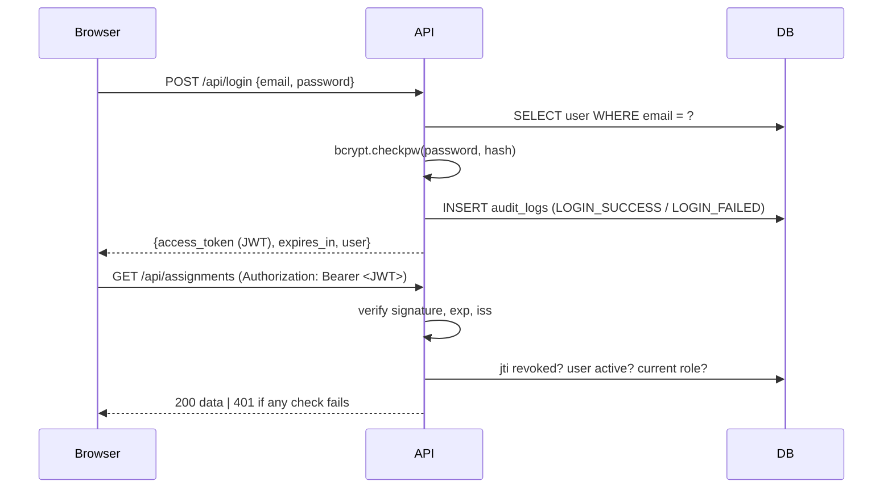

# 5 & 8. User roles, authentication and authorization

## 5.1 Roles

| Role | Who | How the account is created |
|---|---|---|
| **Student** | Learners | Self-registration (`POST /api/register` always creates `role=student`) |
| **Teacher** | Course instructors | Created by an admin (`POST /api/admin/users`) or by the seed script |
| **Admin** (optional) | Portal operator | Seed script, or promoted by another admin |

Public registration **can never create a teacher or admin**. An extra `"role": "teacher"` field in the request is ignored (see test `test_registration_cannot_escalate_role`).

## 5.2 Role-permission matrix

| # | Action | Endpoint | Student | Teacher | Admin |
|---|---|---|:--:|:--:|:--:|
| 1 | Register | `POST /api/register` | ✅ | — | — |
| 2 | Log in / log out | `POST /api/login`, `/api/logout` | ✅ | ✅ | ✅ |
| 3 | View own profile | `GET /api/me` | ✅ | ✅ | ✅ |
| 4 | List courses | `GET /api/courses` | enrolled | owned | all |
| 5 | Create course | `POST /api/courses` | ❌ 403 | ✅ (owner = self) | ✅ (assigns teacher) |
| 6 | Join course by code | `POST /api/courses/join` | ✅ | ❌ 403 | ❌ 403 |
| 7 | View roster / enroll student | `GET/POST /api/courses/{id}/students` | ❌ 403 | owned course | ✅ |
| 8 | List assignments | `GET /api/assignments` | enrolled courses (+ my status) | owned courses (+ counts) | all |
| 9 | View assignment | `GET /api/assignments/{id}` | if enrolled, else 403 | if owner, else 403 | ✅ |
| 10 | Create / update assignment, set deadline | `POST/PUT /api/assignments…` | ❌ 403 | owned course | ✅ |
| 11 | Delete assignment | `DELETE /api/assignments/{id}` | ❌ 403 | owned course | ✅ |
| 12 | Upload / resubmit | `POST /api/assignments/{id}/submit` | if enrolled | ❌ 403 | ❌ 403 |
| 13 | View own submissions | `GET /api/submissions/me` | ✅ | ❌ 403 | ❌ 403 |
| 14 | View a submission | `GET /api/submissions/{id}` | **own only** | owned course | ✅ |
| 15 | Download a submission (signed URL) | `GET /api/submissions/{id}/download` | own only | owned course | ✅ |
| 16 | View all submissions of an assignment | `GET /api/assignments/{id}/submissions` | ❌ 403 | owned course | ✅ |
| 17 | Grade (marks + feedback) | `POST /api/submissions/{id}/grade` | ❌ 403 | owned course | ✅ |
| 18 | View marks & feedback | `GET /api/submissions/{id}/feedback` | own only | owned course | ✅ |
| 19 | Student dashboard | `GET /api/dashboard/student` | ✅ | ❌ 403 | ❌ 403 |
| 20 | Teacher dashboard / statistics | `GET /api/dashboard/teacher` | ❌ 403 | own courses | portal-wide |
| 21 | Manage users & roles | `/api/admin/users…` | ❌ 403 | ❌ 403 | ✅ |
| 22 | View audit log | `GET /api/admin/audit-logs` | ❌ 403 | ❌ 403 | ✅ |

---

# 8. Authentication & authorization

## Authentication: "Who are you?"



| Piece | Implementation |
|---|---|
| Password storage | bcrypt with a per-password salt, cost 12 (`cloud/auth_service.py`). The plain password is never stored or logged. |
| Password policy | 8–72 chars, at least one letter and one digit (server-side, `backend/schemas/validation.py`) |
| Token | JWT HS256 signed with `SECRET_KEY`; claims `sub`, `role`, `jti`, `iat`, `exp`, `iss` |
| Expiry | `ACCESS_TOKEN_EXPIRE_MINUTES` (default 60) |
| Logout | `POST /api/logout` stores the token's `jti` in `revoked_tokens`, and every request checks it, so the token stops working immediately (tests TC-24/25) |
| Brute-force protection | 20 login/register attempts per IP per minute (`backend/middleware/rate_limit.py`) → 429 |
| User enumeration | Same message and similar timing for "wrong password" and "no such email" |
| Session validation | `get_auth_context` validates signature/expiry/issuer, revocation, and that the account exists and is active |

## Authorization: "What are you allowed to do?"

Two layers, both on the **server**:

1. **Role check (coarse).** A route declares who may call it:
   ```python
   @router.post("/{submission_id}/grade")
   def grade_submission(..., user: User = Depends(require_teacher)):   # teacher or admin
   ```
2. **Ownership check (fine).** The service checks the specific resource:
   ```python
   def ensure_can_view_submission(user, submission):
       if user.role == "admin": return
       if user.role == "student":
           if submission.student_id != user.user_id: raise ForbiddenError(...)
           return
       if submission.assignment.course.teacher_id != user.user_id: raise ForbiddenError(...)
   ```

The role is **re-read from the database** on every request instead of trusting the `role` claim inside the token. When an admin demotes or disables someone, it applies to their very next request.

## Required protections and how each is enforced

| Requirement | Enforcement | Proof (test) |
|---|---|---|
| Student cannot open Teacher Dashboard | Route `require_teacher` → 403; React `ProtectedRoute` shows the 403 page | `test_tc04_student_dashboard_authorization` |
| Student cannot grade submissions | `require_teacher` on grade route | `test_tc20_unauthorized_grading_rejected` |
| Student cannot view another student's submission | `ensure_can_view_submission` on details, feedback **and** download | `test_tc15_…` (checks all three endpoints) |
| Teacher can access only permitted course information | `can_manage_course` / `ensure_can_view` compare `course.teacher_id` | `test_other_teacher_cannot_view_submissions`, `test_teacher_cannot_create_in_other_teachers_course` |
| Unauthorized users cannot directly download private files | Private bucket; files only via signed URL issued after the checks above; local provider verifies HMAC + expiry | `test_unauthenticated_download_rejected`, `test_tampered_or_expired_signed_url_rejected` |

## Frontend role-based routing

`frontend/src/components/ProtectedRoute.jsx`:

* not logged in → redirect to `/login` (and back after login)
* wrong role → 403 page ("This page is for teacher or admin accounts")

After login, users land on their role's home: student → `/student`, teacher → `/teacher`, admin → `/teacher` (portal-wide overview) with an extra **Users & audit** menu.

Hiding a button is only user experience. **Security lives in the API.** You can prove this in a demo by calling a teacher endpoint with a student token using Swagger `/docs`: you get `403`.
