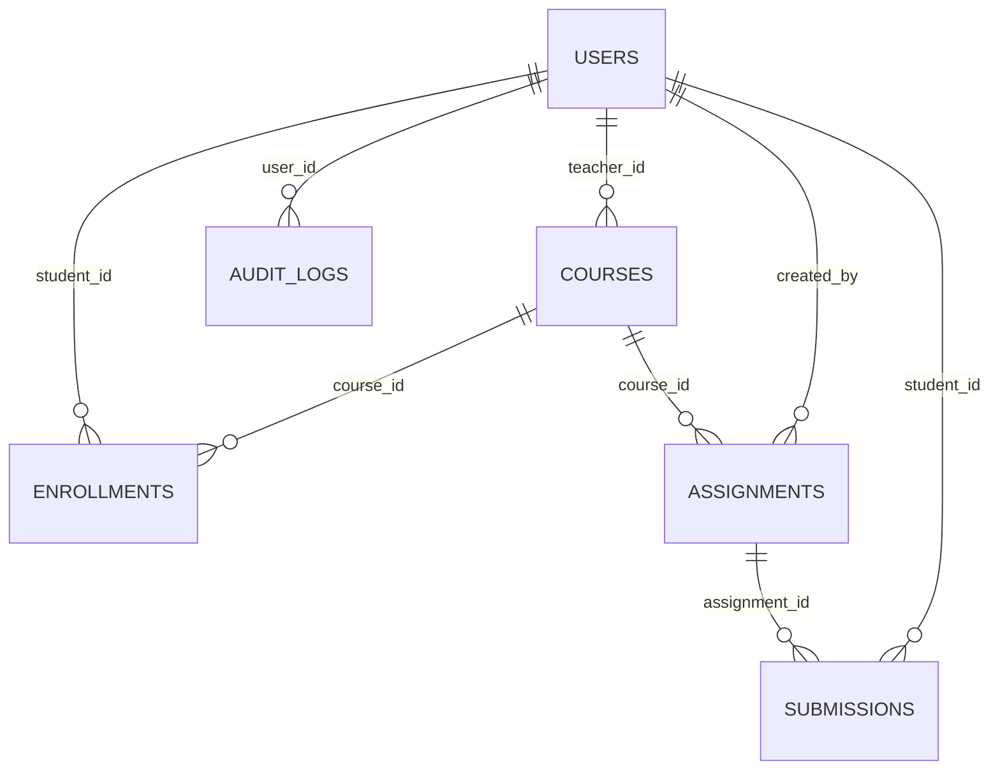

# 6. Database design (and 13. dashboard queries)

Implemented with SQLAlchemy 2.0 models in `backend/models/`. The same models run on **SQLite** (local) and **PostgreSQL** (Supabase / Neon / RDS). Timestamps are stored in **UTC** (`backend/models/types.py`).

## 6.1 Entity-relationship diagram



Hierarchy:

```
Teacher (users.role = 'teacher')
   ↓ 1..*            courses.teacher_id
Course
   ↓ 1..*            assignments.course_id
Assignment
   ↓ 1..*            submissions.assignment_id
Submission
   ↓ *..1            submissions.student_id
Student (users.role = 'student')      ← also linked to Course through ENROLLMENTS (many-to-many)
```

## 6.2 Tables

### USERS
| Column | Type | Constraints | Notes |
|---|---|---|---|
| user_id | INTEGER | **PK**, auto-increment | |
| name | VARCHAR(120) | NOT NULL | |
| email | VARCHAR(255) | **UNIQUE**, INDEX, NOT NULL | lower-cased; login lookup |
| password_hash | VARCHAR(255) | NOT NULL | bcrypt hash, never the password |
| role | VARCHAR(20) | INDEX, NOT NULL | `student` / `teacher` / `admin` |
| is_active | BOOLEAN | default TRUE | admin can disable |
| created_at | TIMESTAMP (UTC) | NOT NULL | |

### COURSES
| Column | Type | Constraints |
|---|---|---|
| course_id | INTEGER | **PK** |
| course_code | VARCHAR(20) | **UNIQUE** (e.g. `CC401`) |
| course_name | VARCHAR(150) | NOT NULL |
| description | TEXT | |
| teacher_id | INTEGER | **FK → users.user_id**, INDEX |
| join_code | VARCHAR(12) | **UNIQUE**, INDEX |
| created_at | TIMESTAMP | |

### ENROLLMENTS (added to model "assigned coursework")
| Column | Type | Constraints |
|---|---|---|
| enrollment_id | INTEGER | **PK** |
| course_id | INTEGER | **FK → courses** ON DELETE CASCADE, INDEX |
| student_id | INTEGER | **FK → users** ON DELETE CASCADE, INDEX |
| enrolled_at | TIMESTAMP | |
| | | **UNIQUE(course_id, student_id)** |

### ASSIGNMENTS
| Column | Type | Constraints / notes |
|---|---|---|
| assignment_id | INTEGER | **PK** |
| course_id | INTEGER | **FK → courses** ON DELETE CASCADE |
| title | VARCHAR(200) | NOT NULL |
| description | TEXT | |
| deadline | TIMESTAMP (UTC) | NOT NULL |
| max_marks | FLOAT | > 0 (validated) |
| allowed_file_types | VARCHAR(200) | e.g. `pdf,docx` |
| max_file_size_mb | INTEGER | ≤ portal `MAX_UPLOAD_MB` |
| allow_late_submission | BOOLEAN | late policy |
| allow_resubmission | BOOLEAN | resubmission policy |
| created_by | INTEGER | **FK → users** |
| created_at, updated_at | TIMESTAMP | |
| | | **INDEX(course_id, deadline)** |

### SUBMISSIONS
| Column | Type | Notes |
|---|---|---|
| submission_id | INTEGER | **PK** |
| assignment_id | INTEGER | **FK → assignments** ON DELETE CASCADE |
| student_id | INTEGER | **FK → users**, INDEX |
| file_name | VARCHAR(255) | sanitized original name (display only) |
| file_url | VARCHAR(500) | provider URI: `s3://bucket/key` or `local://key`. **Not** a public link |
| storage_path | VARCHAR(500) | object key |
| file_size | INTEGER | bytes |
| content_type | VARCHAR(120) | derived from the validated extension |
| checksum_sha256 | CHAR(64) | integrity proof |
| submitted_at | TIMESTAMP (UTC) | **server** time |
| submission_status | VARCHAR(20) | `SUBMITTED` / `LATE` / `GRADED` |
| is_late | BOOLEAN | kept after grading |
| attempt_number | INTEGER | 1, 2, 3 … on resubmission |
| idempotency_key | VARCHAR(100) | retry protection |
| marks | FLOAT NULL | |
| feedback | TEXT NULL | |
| graded_at | TIMESTAMP NULL | |
| graded_by | INTEGER NULL | **FK → users** |
| | | **UNIQUE(assignment_id, student_id)**, **INDEX(assignment_id, submission_status)** |

### AUDIT_LOGS and REVOKED_TOKENS
`audit_logs(audit_id PK, user_id FK NULL, action, entity_type, entity_id, details JSON-text, ip_address, created_at INDEX)` records LOGIN_SUCCESS/FAILED, SUBMISSION_CREATED/REPLACED, SUBMISSION_GRADED/REGRADED, FILE_ACCESS_GRANTED, ASSIGNMENT_*, USER_*.
`revoked_tokens(jti PK, user_id, expires_at INDEX, revoked_at)` holds logged-out tokens. Expired rows are purged at each logout.

## 6.3 Keys and relationships explained

* **Primary key (PK)**: unique identifier of a row (`submission_id`). Integer surrogate keys never change, even if an email or title changes.
* **Foreign key (FK)**: a column pointing to another table's PK (`submissions.assignment_id → assignments.assignment_id`). The DB refuses orphans (for example, a submission for a non-existent assignment). SQLite needs `PRAGMA foreign_keys=ON`, which `database_service.py` sets.
* **One-to-many**: a teacher has many courses, a course has many assignments, an assignment has many submissions.
* **Many-to-many**: students ↔ courses through `enrollments`.
* **Unique constraints as business rules**: `UNIQUE(assignment_id, student_id)` means that even if two upload requests race, only one submission row can exist. The loser gets `409` and its uploaded object is removed.

## 6.4 Indexing

| Index | Query it speeds up |
|---|---|
| `users.email` (unique) | login: `WHERE email = ?` |
| `users.role` | admin filter by role |
| `courses.teacher_id` | "my courses" for a teacher |
| `enrollments(course_id)`, `(student_id)` | roster; "courses I'm in" |
| `assignments(course_id, deadline)` | assignments of my courses ordered by deadline; upcoming deadlines |
| `submissions(student_id)` | "my submissions" |
| `submissions(assignment_id, submission_status)` | teacher list and pending-review counts |
| `audit_logs(created_at)`, `(action)` | recent events, filtering |

Without indexes these become full-table scans, which is fine for 50 rows and slow for 5 million.

## 6.5 Typical cloud-database queries

```sql
-- Student: assignments of my courses with my status
SELECT a.*, s.submission_status
FROM assignments a
JOIN enrollments e ON e.course_id = a.course_id AND e.student_id = :me
LEFT JOIN submissions s ON s.assignment_id = a.assignment_id AND s.student_id = :me
ORDER BY a.deadline;

-- Teacher: roster + status for one assignment (NOT_SUBMITTED = no row)
SELECT u.name, COALESCE(s.submission_status, 'NOT_SUBMITTED') AS status, s.submitted_at, s.marks
FROM enrollments e
JOIN users u ON u.user_id = e.student_id
LEFT JOIN submissions s ON s.student_id = e.student_id AND s.assignment_id = :assignment
WHERE e.course_id = :course;

-- Grade (the only write path for marks)
UPDATE submissions
SET marks = :marks, feedback = :fb, submission_status = 'GRADED', graded_at = now(), graded_by = :teacher
WHERE submission_id = :id;
```

## 6.6 Why files are NOT stored as BLOBs in the database

| Concern | BLOB in DB | Object storage + key in DB ✅ |
|---|---|---|
| Cost | Managed DB storage is ~10× the price per GB | Cheap per GB, tiered classes |
| Performance | Large rows bloat tables, cache and every backup | DB stays small and fast |
| Scalability | Single DB server bottleneck for downloads | Storage serves downloads directly (signed URLs, CDN) |
| Backups | Hours-long dumps full of PDFs | Small DB dumps; storage has its own versioning |
| Features | None | Signed URLs, lifecycle rules, SSE, event triggers |
| Free-tier fit | 500 MB DB fills up after a few hundred PDFs | GBs of storage for free |

---

# 13. Dashboard queries

Implemented in `backend/services/dashboard_service.py`. Counts are computed **in the database** with aggregates, not by loading rows into Python.

### Student dashboard (`GET /api/dashboard/student`)
| Widget | Logic |
|---|---|
| Welcome, *name* | `users.name` |
| Total assignments | assignments in enrolled courses |
| Pending | assignments with **no** submission row |
| Overdue | pending and past deadline |
| Submitted | student's submission rows |
| Late | submissions with `is_late = true` |
| Graded | `submission_status = 'GRADED'` |
| Average score | mean of `marks / max_marks` over graded |
| Upcoming deadlines | pending and `deadline > now`, next 5 by deadline |
| Recent feedback | graded, ordered by `graded_at DESC`, 5 rows |

### Teacher dashboard (`GET /api/dashboard/teacher`)
```sql
SELECT COUNT(*) FROM assignments WHERE course_id IN (:my_courses);                 -- Total assignments
SELECT COUNT(DISTINCT student_id) FROM enrollments WHERE course_id IN (:my_courses); -- Total students
SELECT s.submission_status, COUNT(*)                                                -- Submitted / Late / Graded
FROM submissions s JOIN assignments a ON a.assignment_id = s.assignment_id
WHERE a.course_id IN (:my_courses) GROUP BY s.submission_status;
SELECT COUNT(*) FROM submissions s JOIN assignments a USING (assignment_id)        -- Late (even if graded)
WHERE a.course_id IN (:my_courses) AND s.is_late;
SELECT … ORDER BY s.submitted_at DESC LIMIT 6;                                      -- Recent uploads
SELECT … WHERE a.deadline > now() ORDER BY a.deadline LIMIT 5;                      -- Upcoming deadlines (+ counts)
```
*Pending reviews* = SUBMITTED + LATE (uploaded but not graded). An admin gets the same dashboard across **all** courses.
