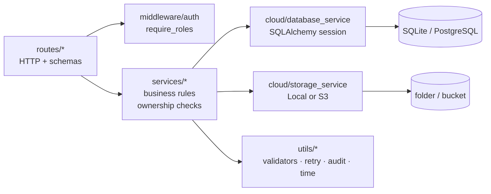
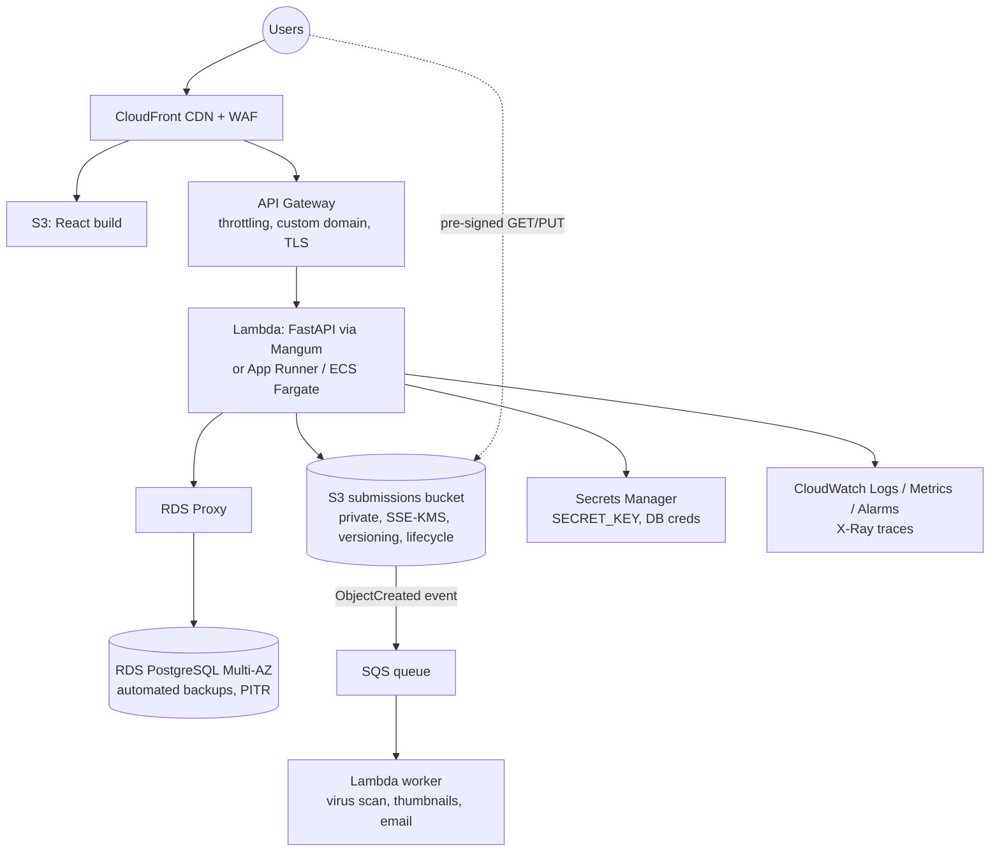

# 15 & 16. System architecture, workflows and folder structure

## 15.1 Implemented architecture (free-tier cloud)

```
          Student / Teacher / Admin  (any browser, any device)
                         │  HTTPS
                         ▼
        ┌──────────────────────────────────┐
        │  React web app (static files)    │  Vercel / Netlify CDN
        └──────────────────────────────────┘
                         │  REST + JSON, Authorization: Bearer <JWT>
                         ▼
        ┌──────────────────────────────────┐
        │  Authentication service          │  cloud/auth_service.py  (bcrypt, JWT, revocation)
        ├──────────────────────────────────┤
        │  REST API (FastAPI routes)       │  backend/routes/*
        ├──────────────────────────────────┤
        │  Backend services                │  backend/services/*  (rules + ownership checks)
        └──────────────────────────────────┘
               ↙                         ↘
  ┌───────────────────────┐   ┌─────────────────────────────┐
  │ Cloud DB (PostgreSQL) │   │ Object storage (private)    │
  │ Supabase / Neon / RDS │   │ Supabase Storage / R2 / S3  │
  └───────────────────────┘   └─────────────────────────────┘
               ↓
  ┌─────────────────────────────────────────────┐
  │ Logging / monitoring                        │
  │ stdout logs + request IDs · /api/health ·   │
  │ audit_logs table · platform metrics         │
  └─────────────────────────────────────────────┘
```

### Layers inside the backend



* **Routes** parse HTTP, declare the required role and call one service function.
* **Services** hold the rules (deadline, resubmission, marks ≤ max) and resource-level authorization. They know nothing about HTTP, so a Lambda worker or CLI could reuse them.
* **Cloud layer** hides providers behind an interface: `StorageService` has `LocalStorageService` and `S3StorageService`, and the database is chosen by `DATABASE_URL`.

## 15.2 Advanced cloud architecture (AWS example)



## 15.3 Complete request and data flow

### a) Login
1. React posts `{email, password}` to `/api/login`.
2. The rate limiter counts the attempt for this IP.
3. The user is looked up by the unique email index, and bcrypt compares the hash.
4. A JWT is created with `sub`, `role`, `jti` and `exp`. An audit row `LOGIN_SUCCESS` is written.
5. React stores the token and user in `localStorage` and routes to `/student` or `/teacher`.

### b) Teacher creates an assignment
1. `POST /api/assignments` with the JWT. `require_teacher` passes, then `get_course_for_manager` checks that the course is theirs.
2. Validation: future deadline, types within the portal whitelist, size within the portal limit, `max_marks` in range.
3. `INSERT assignments` plus an audit row are committed in one transaction. The response is 201.

### c) Student uploads
See the sequence diagram in the README. In short: auth → enrollment → **server-time deadline** → resubmission and idempotency policy → validation → **storage PUT (retry)** → **DB commit (compensate on failure)** → delete the previous object if this was a resubmission → 201/200.

### d) Teacher reviews and grades
1. `GET /api/assignments/{id}/submissions` lists the roster and statuses.
2. "Open file" → `GET /api/submissions/{id}/download?disposition=inline` → authorization → signed URL → the browser loads the PDF **directly from storage**.
3. `POST /api/submissions/{id}/grade` → validation → `UPDATE submissions` → audit → commit.

### e) Student views feedback
Student dashboard → recent feedback → `GET /api/submissions/{id}/feedback` (ownership check) → the red-pen marks and margin note are displayed.

---

## 9. Assignment management (design notes)

| Function | Service | Validation |
|---|---|---|
| `createAssignment()` | `assignment_service.create_assignment` | course ownership; title 3–200 chars; deadline in the future (converted to UTC); `0 < max_marks ≤ 1000`; allowed types ⊆ `ALLOWED_FILE_TYPES`; `1 ≤ max_file_size_mb ≤ MAX_UPLOAD_MB`; late/resubmission flags default from env |
| `updateAssignment()` | `update_assignment` | same rules on changed fields; new deadline must be in the future; `max_marks` cannot drop below the highest mark already given |
| `deleteAssignment()` | `delete_assignment` | 409 if submissions exist unless `force=true`; then deletes objects (best effort) and rows |
| `getAssignments()` | `get_assignments` | scoped by role; includes `my_status` or submission counts |
| `getAssignmentById()` | `get_assignment_by_id` | enrollment / ownership check |

## 10. Submission system (design notes)

| Check | Where | Failure |
|---|---|---|
| Student authenticated | `require_student` | 401 / 403 |
| Assignment exists | `get_assignment_or_404` | 404 |
| Enrolled in course | `course_service.is_enrolled` | 403 `NOT_ENROLLED` |
| Deadline | `deadline_policy.evaluate_submission_time` | 403 `DEADLINE_PASSED` if late work is disabled |
| Duplicate / resubmission policy | `submit_assignment` | 409 `DUPLICATE_SUBMISSION` / `ALREADY_GRADED` |
| Idempotency | `Idempotency-Key` equals stored key | 200 replay, nothing re-uploaded |
| Extension | `validate_upload` | 415 |
| Size | route reads at most portal limit + 1 byte; `validate_upload` checks the assignment limit | 413 |
| Content | magic bytes / text check | 415 |
| Malware hook | `scan_for_malware` | 415 `MALWARE_DETECTED` |

---

## 11. Deadline logic

```python
# backend/services/deadline_policy.py
def evaluate_submission_time(assignment, now):
    if now <= assignment.deadline:              # both timezone-aware UTC
        return "SUBMITTED", False
    if not assignment.allow_late_submission:    # configurable per assignment
        raise ForbiddenError("…deadline has passed…", code="DEADLINE_PASSED")
    return "LATE", True
```

**Configurable:** each assignment has `allow_late_submission`. New assignments default to the env var `ALLOW_LATE_SUBMISSIONS`, and the teacher sets it with the "Accept late work" checkbox.

**Server-side timestamp:** `now` is `time_utils.utcnow()` on the **server**, taken when the request is processed, and stored as `submitted_at`. The request body has no field for a submission time, so a client cannot supply one.

**Why client time is never trusted:** the student controls their device clock and can set it back an hour. Browser JavaScript and request headers can be edited with DevTools or curl. Only the server clock (synced by NTP on cloud hosts) is outside the student's control.

**Timezones:**
* The teacher picks a deadline in their local time (`datetime-local`). The frontend converts it to UTC (`new Date(value).toISOString()`).
* The API stores UTC (`UTCDateTime` column type) and compares aware UTC datetimes.
* Each viewer's browser shows times in their own timezone with `Intl.DateTimeFormat`.
* Example: a deadline of `2026-09-30T18:30Z` is 00:00 on 1 Oct in India and 11:30 on 30 Sep in California. It is the same instant, so the same decision is made everywhere (`test_deadline_is_timezone_safe`).
* The boundary is inclusive: submitting at exactly the deadline counts as on time.

**Testing late submissions:** tests move the server clock forward (`shift_clock` fixture monkeypatches `time_utils.utcnow`). Manually, set a deadline a few minutes ahead, wait, then upload.

## 12. Feedback & grading

* `gradeSubmission()`: role check (teacher/admin), ownership check (`can_manage`), `0 ≤ marks` (schema) and `marks ≤ max_marks` (service), feedback trimmed, ≤ 5000 chars. Sets `GRADED`, `graded_at`, `graded_by`. Regrading is audited with the previous mark.
* `getSubmissionFeedback()`: same visibility as the submission.
* Students **cannot** modify marks or feedback because no student-accessible endpoint writes those columns, and the grade endpoint rejects the student role.
* After grading, the submission is locked: a resubmission attempt returns 409 `ALREADY_GRADED`.

---

## 16. Folder by folder

```
Cloud-Based-Assignment-Submission-Portal/
├── backend/
│   ├── app.py                FastAPI app factory: CORS, request logging, error handlers, routers, startup (create tables)
│   ├── config.py             Settings dataclass built from environment variables (.env locally)
│   ├── seed.py               Creates fictional users, courses, assignments and sample submissions
│   ├── lambda_handler.py     Mangum adapter: run the same app on AWS Lambda
│   ├── routes/               One module per resource: auth, courses, assignments, submissions, dashboard, admin, files, health
│   ├── models/               SQLAlchemy ORM tables + enums + UTC column type
│   ├── schemas/              Pydantic models: request validation + response shape (drive the OpenAPI docs)
│   ├── services/             Business logic: users, courses, assignments, deadline policy, submissions, grading, dashboards
│   ├── middleware/           auth.py (JWT → user, require_roles), rate_limit.py, request_logging.py (request ID, headers, metrics)
│   └── utils/                validators (file checks), time_utils, retry, errors, audit, logging_config, pdf_builder
├── cloud/
│   ├── database_service.py   Engine + session per request; SQLite pragma; Postgres pooling; health check
│   ├── storage_service.py    StorageService interface, Local and S3 providers, signed URLs
│   └── auth_service.py       bcrypt hashing, JWT create/verify
├── frontend/
│   ├── index.html · vite.config.js · package.json · vercel.json · netlify.toml
│   └── src/
│       ├── main.jsx, App.jsx  entry + route table
│       ├── components/        Layout, ProtectedRoute, FileDropzone, ui.jsx (stamps, grade mark, alerts…)
│       ├── pages/             Login, Register, dashboards, assignments list/detail/form, submissions, courses, admin, 403/404
│       ├── services/          api.js (axios + JWT + 401 handling) and one module per API area
│       ├── context/           AuthContext (current user, login, logout)
│       ├── hooks/             useLoad (fetch-on-mount helper)
│       ├── utils/             date/size formatting, client-side file checks, constants
│       └── styles/            global.css (design tokens, light + dark)
├── tests/                    pytest suite (conftest fixtures, auth, assignments, submissions, grading, dashboards, failures, units, S3)
├── scripts/                  generate_sample_files.py
├── sample_files/             sample PDFs + invalid files for manual testing
├── screenshots/              proof images (see checklist)
├── docs/                     these documents
├── reports/                  project report
├── .github/workflows/ci.yml  CI pipeline
├── Dockerfile, .dockerignore, docker-compose.yml, render.yaml
├── requirements.txt (runtime) · requirements-dev.txt (tests) · pytest.ini
├── .env.example (documented config, no secrets) · .gitignore
└── README.md
```

> The prompt's suggested layout put `components/`, `pages/`, `services/` and `utils/` next to `frontend/src/`. Here they sit **inside** `src/`, which is the standard React/Vite convention and is required for the bundler to import them.
