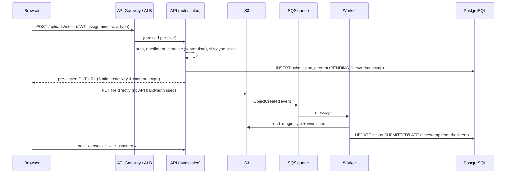

# 22. Scalability

## Why this design already scales

* **Stateless API.** Sessions live in JWTs, not server memory, so any instance can serve any request. Add instances behind a load balancer.
* **Files never touch the database.** The DB stays small; object storage scales on its own.
* **Downloads bypass the API.** Signed URLs let the browser fetch directly from storage or a CDN.
* **Aggregate queries + indexes** for dashboards; connection pooling (`pool_pre_ping`, `pool_size`) for managed PostgreSQL.
* **Idempotent uploads** make client and load-balancer retries safe.

## Architecture by size

| | ~10 students (one class) | ~1,000 students (a college) | ~100,000 students (a university system / EdTech) |
|---|---|---|---|
| Frontend | Vercel free | Vercel/Netlify CDN | CDN (CloudFront) with long-cache hashed assets |
| API | 1 free instance (sleeps when idle) | 2+ always-on instances, autoscale on CPU/latency | Autoscaling container fleet (ECS/Cloud Run 10–200 instances) or Lambda with reserved concurrency, behind API Gateway + ALB |
| Database | SQLite / free Postgres | Managed Postgres (small), daily backups | Postgres Multi-AZ primary + **read replicas** for dashboards; RDS Proxy / PgBouncer; partition `submissions` by term |
| Storage | Local / free bucket | S3/R2 bucket | S3 with **direct pre-signed PUT uploads**, multipart for big files, lifecycle to cold storage |
| Caching | none | none needed | **Redis** for dashboard aggregates, assignment lists, rate limiting |
| Async work | none | none | **Queue (SQS/Pub/Sub) + workers**: virus scan, thumbnails, notification emails, plagiarism checks, grade exports |
| Monitoring | platform logs | uptime check + alerts | CloudWatch/Grafana dashboards, tracing, SLOs, on-call alerts |

## Scaling techniques

| Technique | Role here |
|---|---|
| **Load balancer** | Spreads requests across API instances; health-checks `/api/health` and removes bad instances |
| **Autoscaling** | Adds instances when CPU/requests/latency rise near deadlines; removes them after (elasticity = cost control) |
| **Serverless functions** | Lambda scales per request with no idle cost; good for spiky, deadline-driven traffic (`backend/lambda_handler.py`) |
| **Managed databases** | Vertical scaling with one click, read replicas, automated failover |
| **Object storage** | Effectively unlimited throughput when keys are spread over prefixes (ours are per assignment/student) |
| **CDN** | Serves JS/CSS from edge caches, so the API only handles API calls |
| **Caching** | Cache dashboard numbers for 30–60 s; invalidate on submit/grade |
| **Message queues** | Absorb bursts; the upload request returns immediately and slow work happens later |
| **Background workers** | Consume the queue at a steady rate; scale workers on queue depth |

## Scenario: 100,000 students uploading near a deadline

Assume 40% submit in the last 30 minutes, which is about 40,000 uploads, or 22 per second on average with peaks of 100+/s, each 2–5 MB.

1. **The API only authorizes; S3 absorbs the bytes.** The heavy part (hundreds of GB of uploads) never passes through our servers, so the API fleet stays small.
2. **The server timestamp is taken at the intent step**, so a queue backlog cannot make a student "late".
3. **Autoscaling** adds API instances from CPU/request metrics; API Gateway throttles abusive clients.
4. **The queue smooths spikes.** Workers scan at a steady rate, and the backlog clears minutes after the deadline.
5. **The database handles only small writes.** It uses a connection pool/proxy, and dashboards read from a replica or cache.
6. **Idempotency keys** stop mobile networks that retry uploads from creating duplicates.
7. **Deadline grace.** Many LMSs add a short grace window and show the server clock in the UI to avoid disputes.

The current code implements everything except the direct-to-S3 PUT and the queue. Uploads go through the API, which is correct and simple for ≤10 MB files at class or college scale. The design above is the documented next step.

---

# 23. Failure handling

| Failure | What happens in this system | Where |
|---|---|---|
| **File upload fails (storage error)** | Upload is retried 3× with exponential backoff + jitter; if still failing → **503 `STORAGE_UNAVAILABLE`** "Your submission was NOT saved"; no DB row; UI keeps the file selected with a retry message | `utils/retry.py`, `submission_service._upload_with_retry` |
| **Database temporarily unavailable** | Any SQLAlchemy error → **503 `DATABASE_UNAVAILABLE`** (no stack trace). If it happens *after* the upload, the transaction is rolled back and the uploaded object is **deleted** (compensating action) so storage and DB stay consistent | `app.py` handler, `submit_assignment` |
| **Storage service fails** (whole provider down) | Uploads → 503 as above; downloads → 503; `/api/health` reports `degraded` (HTTP 503) so monitors alert | `routes/health.py` |
| **Authentication token expires** | 401 `TOKEN_INVALID` "Your session has expired"; frontend interceptor clears the session and shows the login page with the message; user logs in and continues | `middleware/auth.py`, `frontend/src/services/api.js` |
| **Duplicate submission request** (double click, retried POST) | Same `Idempotency-Key` → returns the saved submission with `replayed: true` (200), nothing re-uploaded. Two *different* first uploads racing → the `UNIQUE(assignment_id, student_id)` constraint keeps one; the other gets 409 and its object is removed | `submit_assignment` |
| **Internet drops during upload** | Request never completes, so nothing is committed (the DB write happens only after the full file is received and stored). The UI shows "Cannot reach the server… press Upload to retry", and the retry reuses the same idempotency key | `AssignmentDetailPage.jsx` |
| **Backend server fails** | Platform health checks fail → instance restarted or replaced; other instances keep serving (stateless); in-flight requests fail cleanly and are retried by the user; no local state is lost because files and data live in managed services | Dockerfile `HEALTHCHECK`, `render.yaml healthCheckPath` |
| **Signed link leaked** | Works for at most 5 minutes; tampering → 403 | `storage_service.py` |
| **Old object cleanup fails after a resubmission** | Logged as a warning; the new submission is already saved. A storage lifecycle rule or cleanup job removes orphans | `_safe_delete` |

## Retry strategy

* Retry only **transient** errors (timeouts, 5xx, throttling) on **idempotent** operations. `PUT` to the same key is idempotent.
* **Exponential backoff with jitter**: 0.2 s, 0.4 s, 0.8 s + random, so thousands of clients don't retry in lockstep (thundering herd).
* **Cap attempts** (3). Then fail fast with a clear message rather than hanging.
* boto3 adds its own standard-mode retries for S3; the app-level retry covers every provider.
* Don't retry validation errors (4xx). They will fail again.

## Idempotency

An operation is **idempotent** if doing it twice has the same effect as doing it once. Networks can deliver a request, lose the response, and make the client retry. Without idempotency the student would get two submissions (or attempt 2). The client sends a unique `Idempotency-Key` per attempt. The server stores it with the submission, and a repeat of the same key returns the stored result instead of acting again. Payment APIs such as Stripe use the same technique.
